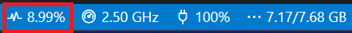

= SAÉ 2.02
:icons: font
:numbered:
:toc: left
:toc-title: Sommaire
:toclevels: 1
// Antora 
// => traduction automatique fr/uk
// => niveau de guidage
//include:definitions.txt (glossaire des termes du BUT comme SAE)

// Specific to GitHub
ifdef::env-github[]
:toc:
:tip-caption: :bulb:
:note-caption: :information_source:
:important-caption: :heavy_exclamation_mark:
:caution-caption: :fire:
:warning-caption: :warning:
:graduation-icon: :mortar_board:
:cogs-icon: :writing_hand:
:beginner: :arrow_right:
:advanced: :arrow_upper_right:
:expert: :arrow_up:
:dollar: :dollar:
:git: link:{giturl}[git]
:us-icon: :us:
:fr-icon: :fr:
endif::[]

// Local variables

:codacy: https://www.codacy.com[Codacy]
:joular: https://www.noureddine.org/research/joular[Joular]

== Auteur(s)

=== Du sujet...
- mailto:bruel@irit.fr[Jean-Michel Bruel]
- Version: 2023.01 (BUT1 2023)
//- Kata length: 12 hours
- Durée :  12 heures (3 heures à domicile, 1 TD et 1 TP encadrés, 3 créneaux en autonomie)

Merci à mailto:saadialbane@gmail.com:[Saadia Albane] pour l'idée du problème à résoudre

=== De la solution...

* LAST NAME : BIZET
* First name : Julien
* TD group : 
- [ ] 1
- [x] 2
- [ ] 3
- [ ] 4

// == Objectives
== Objectifs

L'objectif de cette SAÉ (**S**ituation d'**A**pprentissage et d'**É**valuation) est d'approfondir la réflexion sur l'approche algorithmique des problèmes rencontrés pendant les phases de développement. (cf. link:docs/sae2.02.pdf[]).

Plus précisément :

  - Participer à un concours de codage
  - Lire, comprendre et évaluer un code qui n'est pas le sien
  - Comparer des algorithmes sur un critère précis
  - Justifier de manière objective ses comparaisons et son classement

// == Documents fournis

//   - IEEE 2021 International Requirements Engineering Conference
//   - [Proposal](./docs/tutorial_proposal.pdf)
//   - [Tutorial Handout](./docs/handout.pdf)

//== Prerequisites
// == Pré-requis

== Description

Cette SAÉ se déroule en 2 phases.

=== Phase 1 : concours d'algorithme

Vous allez devoir soumettre un algorithme qui résout un problème simple (niveau BUT S1) mais qui peut se régler avec plusieurs solutions différentes. 
Vous avez la semaine 22 (non encadrée, mais questions sur Discord bienvenues) pour réaliser et soumettre votre (ou vos) solutions. 

WARNING: Cette 1ère phase est **individuelle**.

Le problème est le suivant :

Un explorateur a découvert un texte d'un peuple ancien (`texte`) rempli de mots (ensembles contigus de lettres).
Il pense avoir trouvé l'ensemble des lettres premières utilisées, ainsi que l'ordre (`ordre`) utilisé par ce peuple pour les classer et ainsi réaliser leurs dictionnaires.
Il  vous demande d'écrire une fonction (java ou C) qui classe les mots d'un `texte` en fonction de `ordre` (comme il n'est pas sûr de lui il veut faire plusieurs essais). 

Exemple d'input::
texte = `"Il fait beau aujourd'hui comme en aout"`
+
ordre = `['f', 'I', 'z', 'u', 'k', 'a', 'b', 'o']`

Exemple d'ouput::
`["fait", "Il", "aujourd", "aout", "beau", "hui", "comme", "en"]`

Les contraintes sont les suivantes :

- votre algorithme doit être écrit dans l'un des langages suivants au choix : java, ou C
- il doit permettre à l'un des 2 programmes principaux fournis (java ou C) de fonctionner (respect donc des noms de classes, méthodes ou fonctions en conséquence). Le choix du nom de la fonction n'est donc pas libre!
- le texte est donné sous forme d'une chaîne de caractères (sans accents pour éviter les soucis)
- l'ordre est donné sous forme de liste de lettres
- si l'ordre n'est pas complet, tout mot commençant par une lettre "inconnue" est placé après le dernier classé, sans contrainte d'ordre vis-à-vis des autres non-classés

Vu qu'il existe de nombreuses façons de résoudre ce problème, vous devrez soumettre, pour chaque catégorie, votre meilleure solution et votre pire  solution.

Simplicité::
  Ici il s'agit de faire un code facile à maintenir, lisible par des humains.  Pas forcément efficace, mais très facile à lire et à réutiliser. Toute méthode de `java.util` existante est autorisée.

Efficacité::
  Peu importe le code source, c'est l'efficacité de son exécution qui est recherchée (complexité maîtrisée, temps d'exécution minimal, ...). Ici aucune méthode complexe (de type `split()` ou `sort()`) ne devra être utilisée (contrairement à celles de type `size()` ou `length()` qui sont autorisées).

Sobriété numérique::
  L'algorithme consomme le moins de ressources possible (mémoire, calcul, ...).

NOTE: Vous pouvez soumettre plusieurs algorithmes dans plusieurs catégories pour maximiser vos chances de gagner le concours et obtenir des points bonus.

WARNING: Nous sommes conscients que vous pouvez vous aider de ChatGPT ou des codes de vos collègues, mais la notation qui a le plus gros coefficient est l'oral final. Si vous êtes incapable d'expliquer vos propres résultats, cette note s'approchera de 0.

==== Dépôt

Vous devrez déposer sur https://webetud.iut-blagnac.fr/mod/assign/view.php?id=28090[WebEtud], avant *samedi 3 juin à 23h59*, vos fichiers de solutions en les nommant ainsi (pour le dépôt) : `[efficacite|sobriete|simplicite]-[meilleur|pire].[java|c]``.

Par exemple pour votre meilleur algorithme java en simplicité, vous le déposerez avec le nom `simplicite-meilleur.java`.

[NOTE]
====
- Si vous en déposez plusieurs d'une même catégorie/type, numérotez-lez (`simplicite-meilleur1.java` et `simplicite-meilleur2.java`)
- Ne mettez aucun commentaire ou élément qui *permettent de vous identifier* dans le code!
- Pensez à déposer aussi les `.h` pour les fonctions C.
====

=== Phase 2 : comparaison et évaluation des solutions

Dans cette deuxième phase, (avec séances encadrées et libres), vous devrez comparer des solutions entre elles, et les classer en justifiant vos analyses.

WARNING: Cette deuxième phase est en binôme (de votre choix)

Vous vous verrez affecter, pour *chaque* catégorie d'algorithmes (Simplicité, Efficacité, Sobriété) un certain nombre de solutions au hasard parmi celles soumises en phase 1.

Il vous faudra évaluer chaque algorithme selon des critères et les classer ensuite.

NOTE: On vous impose au minimum les critères ci-dessous mais vous pourrez en rajouter.
À vous de les utiliser judicieusement pour les catégories les plus appropriées.

=== Critères de comparaison

Lisibilité du code::
  Ce critère est subjectif. Il se base sur la facilité à comprendre ce que fait le code.
Qualité du code::
  Vous utiliserez des outils open source de mesure de qualité de code (e.g., {codacy}).
Efficacité::
  Il s'agit d'évaluer la complexité algorithmique de la solution (`O(n^2)` ou `O(nlog(n))`). Si on double par exemple la taille de la donnée en entrée, est-ce qu'on double le temps de calcul ?
Sobriété numérique::
  Cela devient un critère de plus en plus important. Certains outils permettent de donner une mesure de la consommation en ressources d'un algorithme (e.g., {joular}).
Temps d'exécution::
  Il s'agit de mesurer le temps d'exécution.
+
WARNING: Il conviendra de prendre des mesures sur des données plus ou moins grandes, certains algorithmes étant plus rapides que d'autres en fonction de la taille des données en entrée (beaucoup de mots dans la chaîne initiale), ou de leur variété (beaucoup de grands mots).

// == Deliverables
== Livrables

Vous utiliserez le dépôt initial qui vous aura été attribué via classroom pour pousser vos codes et vos livrables (en plus des dépôts moodle).
//https://classroom.github.com/a/UXmIvsjX

=== Phase 1 (deadline : **samedi 3 juin 2023** à minuit)

* [ ] Votre ou vos algorithmes en précisant les éléments du tableau ci-dessous :

[options="header"]
|==========================================================================
| #    | lien                                                     | langage  | catégorie  |  Type
| 1    | link:src/main/java/exercice/Exercice1.java[meilleur java]| Java     | Simplicité | Meilleur
| 2    | link:src/main/java/exercice/Exercice2.java[pire java]    | Java     | Efficacité | Pire
| ...  | ...                                                      | ...      | ...      
|==========================================================================

=== Phase 2 (deadline : **vendredi 16 juin 2023** à minuit)

* [ ] Le rapport d'évaluation des algorithmes (e.g., asciidoc ou PDF). Pour chaque catégorie, vous devrez désigner qui est 1er, 2ème, 3ème, ... (avec possibilité d’ex-aequo si le hasard vous a attribué des algos similaires). Il doit se trouver dans le répertoire `rapport` de votre dépôt.
* [ ] Les codes de test, d'évaluation ou de mesure. Ils doivent se trouver dans le répertoire `analyse` de votre dépôt.
* [ ] Les références des librairies/outils utilisés (pour ceux non fournis). Elles doivent être listées dans la sous-section (Références) ci-dessous.
* [ ] La chaîne de compilation et exécutable, ou paquetage selon les standards du langage (comment exécuter vos codes d'évaluation). Cette description doit se trouver dans vos rapports.

WARNING: Les répertoires et fichiers existants devront être complétés et mis à jour sans être renommés. Les binaires de compilation (répertoire `bin` ou `target` par exemple) ne devront pas être poussés sur le dépôt.

=== Pré-requis

Voici les pré-requis pour exécuter nos codes d'évaluation.

. Assurez-vous d'avoir installé le JDK (Java Development Kit) sur votre système. Vous pouvez le télécharger depuis le site officiel d'Oracle et suivre les instructions spécifiques à votre système d'exploitation.

. Télécharger et installer Visual Studio Code à partir du site officiel : link:https://code.visualstudio.com/[lien pour installer VSCode]. Choisissez la version appropriée pour votre système d'exploitation et suivez les instructions d'installation.

. Dans Visual Studio Code, installez l'extension "Java Extension Pack". Pour cela, ouvrez Visual Studio Code, cliquez sur l'icône des extensions dans la barre latérale (ou utilisez le raccourci "Ctrl+Shift+X") et recherchez "Java Extension Pack". Cliquez sur "Installer" pour ajouter l'extension à votre environnement.

. Télécharger les projets que vous souhaitez tester depuis le dépôt approprié. Assurez-vous de récupérer tous les fichiers sources et les dépendances nécessaires.

. Ouvrer Visual Studio Code et ouvrez le dossier du projet que vous souhaitez tester. Vous pouvez le faire en sélectionnant "File" dans la barre de menu, puis en choisissant "Open Folder" et en naviguant jusqu'au dossier du projet.

. Utiliser les fonctionnalités de Visual Studio Code pour compiler et exécuter le code Java. Par exemple, vous pouvez utiliser la commande "Run" (raccourci "Ctrl+F5") pour exécuter le programme actif ou utiliser les tâches prédéfinies pour effectuer des opérations spécifiques.

=== Reproductibilité

- Pour reproduire nos tests :
. Veuiller récupérer la classe codeTests.java dans le répertoire analyse et le mettre au même endroit que les programmes à tester
. Veiller à bien changer le nom de la classe à tester
. Lancer le programme et c'est fini, à vous d'analyser les tests, s'ils sont bien passés ou non

---

- Pour reproduire nos analyses du temps d'exécution et de la scalabilité :
. Veuiller récupérer la classe codeEvaluationClassement.java dans le répertoire analyse et la mettre au même endroit que les programmes à tester
. Veuiller mettre en commentaire la ligne 6 : qui exécute le programme
. Veiller à bien changer le nom de la classe à tester
. Lancer le programme, et vous voici avec les résultats

---

- Pour reproduire nos analyses de la qualité du code :
. Veiller bien à avoir installé l'extension SonarLint (lien en dessous) sur VSCode
. Si l'étape précédente est bien réussie, recharger votre page pour la mettre à jour
. Aller sur le programme que vous souhaitez vérifier, et regarder les erreurs et ajustements que propose SonarLint

---

- Pour reproduire nos analyses de la complexité du code :
. Veuiller vous rendre sur le site link:https://shunnarski.github.io/BigO.html[site complexité algorithmique]
. Puis, copier/coller votre code dans l'encadré correspondant
. Analyser le résultat obtenu, si cela n'a pas marché et que vous ne savez pas comment calculer la complexité algorithmique, vous pouvez demander à ChatGPT

--- 
- Pour reproduire nos analyses de l'utilisation du CPU :
. Veiller bien à avoir installé l'extension Resource Monitor (lien en dessous) sur VSCode
. Si l'étape précédente est bien réussie, recharger votre page pour la mettre à jour, normalement un bandeau est aparu avec des informations sur votre PC
.  Veuiller récupérer la classe codeEvaluationClassement.java dans le répertoire analyse et la mettre au même endroit que les programmes à tester
. Veuiller mettre en commentaire tout ce qui suit la ligne 6, pour n'avoir qu'à tester le programme
. Veiller à bien changer le nom de la classe à tester
. Lancer le programme plusieurs fois, et vous voici avec les résultats avec votre cpu (encadré en rouge)

=== Références

- Utilisation de la méthode java : System.nanoTime()
- Utilisation de l'extension SonarLint link:https://marketplace.visualstudio.com/items?itemName=SonarSource.sonarlint-vscode[SonarLink extension]
- Utilisation de l'extension Resource Monitor link:https://marketplace.visualstudio.com/items?itemName=mutantdino.resourcemonitor[Resource Monitor extension]
- Utilisation du site Big O notation calculator link:https://shunnarski.github.io/BigO.html[Lien complexité algorithmique]

== Généralités, notation de la SAÉ et résultat du concours

=== Généralités

- Vous pouvez vous entraider pour les outils d'analyse et de performance, voire vous inspirer de ChatGPT
- N'hésitez pas à solliciter vos enseignants des ressources impliquées par cette SAÉ (salon https://discord.com/channels/357245708014977034/1105770228589277224[#sae_2_02_qualité] du serveur discord).

=== Notation

- **90%** de la notation portera sur votre rapport de la phase 2 et vos analyses (véracité, pertinence, qualité, ajout de critères pertinents, ...). L'évaluation comportera un oral en semaine 25 (lors des séances encadrées).
- **10%** de la notation portera sur le classement de votre algorithme de la phase 1 (pertinence de la catégorie choisie, évaluation/classement par les pairs, ...)
- **Bonus** pour les 10 premiers de chaque catégorie du concours de codage et ce, pour chaque "type" (les 1à meilleurs, et les 10 pires)
- **Bonus** pour ceux qui auront proposés plusieurs algos différents (indépendamment de leur classement final)
- **Bonus** supplémentaire pour ceux qui auront proposés des versions en langages différents de leur(s) algo(s)  (indépendamment de leur classement final)

=== Divers

- Pour le résultat du concours, les algorithmes de la catégorie "performances" seront récompensés par langage et par "type".
